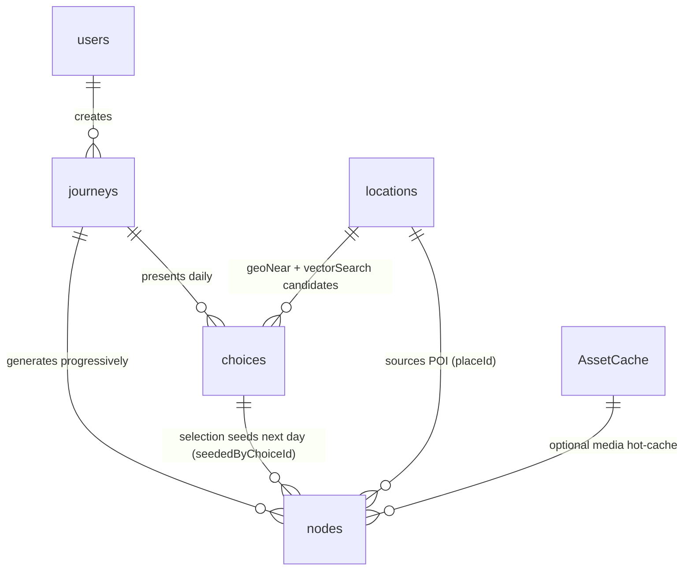

# Project Mini Map — MongoDB Data Models Specification (Draft V1.0)

This document establishes the official BSON schemas, validation rules, relationship mappings, and index layouts for MongoDB Atlas. It serves as the single source of truth for Next.js developers, MongoDB DBA configuration, and Gemini MCP Tool integration.

---

## Part 1 — Common Embedded Structures

These nested structures are reused across multiple collections to maintain strict spatial and financial formatting.

### 1. Multi-Currency Money Structs (`MoneyAmount` / `Money`)

Monetary values are **never** stored as floats or decimals. The backend stores an **integer count of the currency's smallest unit** (its *minor unit*) — MYR 44.00 is `4400` (44 × 100) — and all arithmetic (budget guard, running totals, category rollups) is integer addition/comparison. The frontend receives the value **pre-split** into three parts so it never does float math either: the integer total (`4400`), the major part (`44`), and the zero-padded minor part (`"00"`).

> **Storage vs wire:** in BSON, `minorUnits` / `major` are stored as `NumberLong` (see examples below). On the **JSON wire** (MCP responses and the frontend REST API) they are transmitted as **decimal strings** (`"4400"`, `"44"`) to avoid IEEE-754 / 2⁵³ precision loss — `exponent` stays a number. See [`Backend-Coding-Standards.md` §1.2](Backend-Coding-Standards.md).

#### `MoneyAmount` — a single-currency amount
Used for any **displayed** amount: budgets, rollups, and forward estimates.

```javascript
{
  "currency": "MYR",                 // String — ISO 4217 display currency
  "exponent": 2,                     // Int — minor-unit digits (MYR=2, JPY=0, BHD=3); drives the split
  "minorUnits": NumberLong("4400"),  // Long — AUTHORITATIVE integer total (44.00 MYR). All math uses this.
  "major": NumberLong("44"),         // Long — minorUnits / 10^exponent (integer division)
  "minor": "00"                      // String — minorUnits % 10^exponent, zero-padded to `exponent` digits
}
```
> For a zero-exponent currency (JPY ¥1000): `{ minorUnits: 1000, major: 1000, minor: "" }`.

#### `Money` — a captured price (dual currency)
Used for **real prices fetched from pricing APIs**, which arrive in the destination's currency. Keeps the local origin so the export can show "800 NPR ≈ MYR 44".

```javascript
{
  "display": { "currency": "MYR", "exponent": 2, "minorUnits": NumberLong("4400"),  "major": NumberLong("44"),  "minor": "00" },
  "local":   { "currency": "NPR", "exponent": 2, "minorUnits": NumberLong("80000"), "major": NumberLong("800"), "minor": "00" },
  "fxRate": 0.055,                       // Double — local→display ratio, applied ONCE at capture
  "asOf": ISODate("2026-10-03T08:00:00Z") // Timestamp of FX rate lock (rates drift)
}
```
> `fxRate` is the only non-integer and it touches money exactly once: at capture, `display.minorUnits = round(local.minorUnits × fxRate)`. After that the result is a frozen integer — no read path ever re-multiplies money by a fraction.

### 2. GeoJSON Point Coordinate Struct (`GeoJSON Point`)
Standard spatial coordinate syntax compliant with MongoDB `2dsphere` index requirements.
```json
{
  "type": { "type": "String", "enum": ["Point"] },
  "coordinates": { 
    "type": "Array", 
    "items": "Double", 
    "minItems": 2, 
    "maxItems": 2 // BSON format: [longitude, latitude]
  }
}
```

---

## Part 2 — Collections Specification



- Solid lines = a stored reference (foreign-key field). `locations → choices` is **advisory** (the choice generator reads `locations` via `$geoNear` then `$vectorSearch` but does not persist a per-choice FK back to it).
- `users.userId` is a frontend-supplied string (MVP, no auth); every other cross-collection link is an `ObjectId`, except `placeId` which is the Google `place_id` string.

---

### 1. `users` Collection
Stores persistent user profile states, general interests, and the geographical virtual passport stamps.

#### 1.1 Logical Schema & Relationship
- **Relationship**: 1-to-Many with `journeys` (each user can run multiple virtual journeys).
- **Embedded Stamp**: Records a history of completed trips containing aggregated trip costs.

#### 1.2 BSON Document Schema
```javascript
{
  "_id": ObjectId("60c72b2f9b1d8b2bad000001"),
  "userId": "user_abc123",                    // MVP Unique string identifier from frontend session
  "name": "SeeChen Lee",
  "email": "leeseechen@gmail.com",
  "passport": {
    "stamps": [
      {
        "journeyId": ObjectId("60c72b2f9b1d8b2bad000002"),
        "destinationName": "Kathmandu, Nepal",
        "coordinates": {
          "type": "Point",
          "coordinates": [85.3240, 27.7172]  // [longitude, latitude]
        },
        "completedAt": ISODate("2026-10-10T12:00:00Z"),
        "totalDays": 7,
        // MoneyAmount (single display currency) — a trip-wide rollup has no single local currency
        "totalSpent": { "currency": "MYR", "exponent": 2, "minorUnits": NumberLong("384000"), "major": NumberLong("3840"), "minor": "00" }
      }
    ]
  },
  "createdAt": ISODate("2026-05-17T20:00:00Z"),
  "updatedAt": ISODate("2026-10-10T12:00:00Z")
}
```

#### 1.3 Schema Validation (`$jsonSchema`)
```json
{
  "bsonType": "object",
  "required": ["userId", "passport", "createdAt"],
  "properties": {
    "userId": { "bsonType": "string", "maxLength": 50 },
    "passport": {
      "bsonType": "object",
      "properties": {
        "stamps": {
          "bsonType": "array",
          "items": {
            "bsonType": "object",
            "required": ["journeyId", "destinationName", "coordinates", "completedAt", "totalDays", "totalSpent"],
            "properties": {
              "journeyId": { "bsonType": "objectId" },
              "destinationName": { "bsonType": "string" },
              "coordinates": {
                "bsonType": "object",
                "required": ["type", "coordinates"],
                "properties": {
                  "type": { "enum": ["Point"] },
                  "coordinates": { "bsonType": "array", "minItems": 2, "maxItems": 2 }
                }
              }
            }
          }
        }
      }
    }
  }
}
```

#### 1.4 Index Plan
- `{"userId": 1}` (Unique Index)
- `{"passport.stamps.coordinates": "2dsphere"}` (For mapping out passport stamps dynamically on a global visual map).

---

### 2. `journeys` Collection
The state-machine controller storing active session metadata, cumulative budget usage, and experienced activity tags.

#### 2.1 Logical Schema & Relationship
- **Relationship**: Child of `users`. Parent to `nodes` and `choices`.
- **`visitedTags` array**: Serves as a persistent cache of all experienced location categories, preventing Gemini from offering duplicate experiences in downstream options.

#### 2.2 BSON Document Schema
```javascript
{
  "_id": ObjectId("60c72b2f9b1d8b2bad000002"),
  "userId": "user_abc123",
  "destination": "Kathmandu, Nepal",
  "startDate": ISODate("2026-10-03T00:00:00Z"),
  "totalDays": 7,
  "currentDay": 1,                            // Current active iteration loop state
  "budgetCurrency": "MYR",                    // Display currency (MultiCurrency anchor)
  "budgetExponent": 2,                        // Minor-unit digits for budgetCurrency
  "totalBudgetMinor": NumberLong("600000"),   // 6000.00 MYR as integer minor units
  "remainingBudgetMinor": NumberLong("591900"),// 5919.00 MYR; integer-only budget math, no decimals
  "travelStyle": "backpacker",                // Influences pricing weight and narrative mood
  "interests": ["photography", "temples", "local food"],
  "currentLocation": {
    "type": "Point",
    "coordinates": [85.3559, 27.6966]        // Tracks user's exact geospatial physical position
  },
  "visitedTags": ["airport", "transfer", "thamel"],
  "status": "active",                         // "ready" | "generating" | "active" | "completed"
  "createdAt": ISODate("2026-10-03T08:00:00Z"),
  "updatedAt": ISODate("2026-10-03T09:30:00Z")
}
```

#### 2.3 Schema Validation (`$jsonSchema`)
```json
{
  "bsonType": "object",
  "required": ["userId", "destination", "totalDays", "currentDay", "totalBudgetMinor", "remainingBudgetMinor", "budgetCurrency", "budgetExponent", "status"],
  "properties": {
    "totalDays": { "bsonType": "int", "minimum": 1, "maximum": 14 },
    "currentDay": { "bsonType": "int", "minimum": 0 },
    "budgetCurrency": { "bsonType": "string", "description": "ISO 4217" },
    "budgetExponent": { "bsonType": "int", "minimum": 0 },
    "totalBudgetMinor": { "bsonType": "long", "minimum": 0, "description": "integer minor units — never decimal" },
    "remainingBudgetMinor": { "bsonType": "long", "description": "integer minor units; may be 0 when budget is exhausted" },
    "status": { "enum": ["ready", "generating", "active", "completed"] },
    "currentLocation": {
      "bsonType": "object",
      "required": ["type", "coordinates"],
      "properties": {
        "type": { "enum": ["Point"] },
        "coordinates": { "bsonType": "array", "minItems": 2, "maxItems": 2 }
      }
    }
  }
}
```

#### 2.4 Index Plan
- `{"userId": 1, "status": 1}` (For quick retrieval of active journeys per user)
- `{"currentLocation": "2dsphere"}`

---

### 3. `nodes` Collection
Holds the core immersive daily journal content generated by Gemini. Multiple nodes typically form one single day (represented sequentially by `orderInDay`).

#### 3.1 Logical Schema & Relationship
- **Relationship**: Many-to-1 with `journeys` (Linked via `journeyId`).
- **Media Optimization**: Images are stored as short IDs referencing `AssetCache` strings to optimize pipeline data payload.
- **Embedded Senses & Dialogues**: High-fidelity narrative blocks to drive the immersive client UX.

#### 3.2 BSON Document Schema
```javascript
{
  "_id": ObjectId("60c72b2f9b1d8b2bad000003"),
  "journeyId": ObjectId("60c72b2f9b1d8b2bad000002"),  // -> journeys._id (parent)
  "seededByChoiceId": null,                    // Day 1 = null. Day N+1 -> choices._id of the card the user selected.
  "placeId": "ChIJ0RhONcsZ6zkRpBSF3Gv1vCY",   // -> locations.placeId; null if not a curated POI (e.g. ad-hoc transfer)
  "dayNumber": 1,
  "orderInDay": 0,
  "time": "14:30",
  "title": "Arrival at Tribhuvan International Airport",
  "location": {
    "name": "Tribhuvan International Airport",
    "address": "Ring Rd, Kathmandu 44600, Nepal",
    "coordinates": {
      "type": "Point",
      "coordinates": [85.3559, 27.6966]
    }
  },
  "transport": "Prepaid taxi from the official counter",
  "weather": {
    "condition": "Clear",
    "tempC": 22,
    "source": "OpenWeather"
  },
  "priceCategory": "transport",               // accommodation | food | transport | entry | other
  "price": {                                  // Money (dual-currency, integer minor units)
    "display": { "currency": "MYR", "exponent": 2, "minorUnits": NumberLong("4400"),  "major": NumberLong("44"),  "minor": "00" },
    "local":   { "currency": "NPR", "exponent": 2, "minorUnits": NumberLong("80000"), "major": NumberLong("800"), "minor": "00" },
    "fxRate": 0.055,
    "asOf": ISODate("2026-10-03T08:00:00Z")
  },
  "senses": {
    "see": "Terraced hills folding into haze as the plane drops toward the valley.",
    "hear": "The clatter of the baggage belt, horns leaking through the doors.",
    "smell": "Diesel, incense, and dust — the first breath of Kathmandu.",
    "taste": "The metallic dryness of altitude on the back of your tongue.",
    "touch": "Warm vinyl seat of the taxi, the grit of the window crank.",
    "mood": "Equal parts exhaustion and disbelief that you actually came.",
    "story": "The doors slide open and Kathmandu arrives all at once. Horns blare in odd rhythms..."
  },
  "dialogues": [
    {
      "speaker": "Taxi Driver",
      "language": "ne",
      "text": "Thamel? Paltan ho, sajilo cha.",
      "translation": "Thamel? It's busy, but easy to reach."
    }
  ],
  "culture": {
    "cultureTips": ["Use the official prepaid taxi counter to avoid touts."],
    "localPhrase": {
      "phrase": "Namaste",
      "pronunciation": "nuh-muh-STAY",
      "meaning": "Hello / I bow to you"
    },
    "dosDonts": {
      "dos": ["Greet with both palms together at chest level"],
      "donts": ["Don't hand money or objects with your left hand"]
    }
  },
  "practical": {
    "openingHours": "24h",
    "crowdLevel": "high",
    "bestTimeToVisit": "Daytime arrival for the valley view on descent",
    "photoTip": "Grab a window seat on the left for the Himalayan skyline.",
    "bookingRequired": false
  },
  "media": {
    // Hybrid: a ref is a source URL (default) OR an `asset_*` hash resolved from the optional AssetCache hot-cache.
    "referencePhotos": ["https://images.unsplash.com/photo-1544735716-392fe2489ffa", "asset_f98c1b"],
    "ambientSound": "https://freesound.org/airport-ambient-kdu.mp3"
  },
  "searchTags": ["airport", "arrival", "transfer"],
  "embedding": [0.0123, -0.0456, 0.0891, 0.112], // Voyage AI 1024-dim array (truncated)
  "createdAt": ISODate("2026-10-03T09:00:00Z")
}
```

#### 3.3 Schema Validation (`$jsonSchema`)
```json
{
  "bsonType": "object",
  "required": ["journeyId", "dayNumber", "orderInDay", "title", "location", "priceCategory", "price", "senses", "createdAt"],
  "properties": {
    "journeyId": { "bsonType": "objectId" },
    "seededByChoiceId": { "bsonType": ["objectId", "null"], "description": "choices._id that seeded this day; null on Day 1" },
    "placeId": { "bsonType": ["string", "null"], "description": "-> locations.placeId; null if not a curated POI" },
    "dayNumber": { "bsonType": "int", "minimum": 1 },
    "orderInDay": { "bsonType": "int", "minimum": 0 },
    "location": {
      "bsonType": "object",
      "required": ["name", "coordinates"],
      "properties": {
        "coordinates": {
          "bsonType": "object",
          "required": ["type", "coordinates"],
          "properties": {
            "type": { "enum": ["Point"] },
            "coordinates": { "bsonType": "array", "minItems": 2, "maxItems": 2 }
          }
        }
      }
    },
    "priceCategory": { "enum": ["accommodation", "food", "transport", "entry", "other"] },
    "price": {
      "bsonType": "object",
      "description": "Money — integer minor units only, never decimal",
      "required": ["display", "local", "fxRate"],
      "properties": {
        "display": {
          "bsonType": "object",
          "required": ["currency", "exponent", "minorUnits"],
          "properties": {
            "currency":   { "bsonType": "string" },
            "exponent":   { "bsonType": "int", "minimum": 0 },
            "minorUnits": { "bsonType": "long" },
            "major":      { "bsonType": "long" },
            "minor":      { "bsonType": "string" }
          }
        },
        "local": {
          "bsonType": "object",
          "required": ["currency", "exponent", "minorUnits"],
          "properties": {
            "currency":   { "bsonType": "string" },
            "exponent":   { "bsonType": "int", "minimum": 0 },
            "minorUnits": { "bsonType": "long" },
            "major":      { "bsonType": "long" },
            "minor":      { "bsonType": "string" }
          }
        },
        "fxRate": { "bsonType": "double" },
        "asOf":   { "bsonType": "date" }
      }
    },
    "embedding": {
      "bsonType": "array",
      "items": { "bsonType": "double" }
    }
  }
}
```

#### 3.4 Index Plan
- `{"journeyId": 1, "dayNumber": 1, "orderInDay": 1}` (Compound Unique Index: essential for progressive stream ordering).
- `{"location.coordinates": "2dsphere"}`
- **Atlas Search Full-Text Index**: Exposing `title`, `senses.story`, `searchTags`, and `location.name` to drive Cross-Trip search bars.
- **Atlas Vector Search Index**:
  ```json
  {
    "mappings": {
      "dynamic": false,
      "fields": {
        "embedding": {
          "type": "knnVector",
          "dimensions": 1024,
          "similarity": "cosine"
        }
      }
    }
  }
  ```

---

### 4. `choices` Collection
Records daily card selections offered to the user. Maintains a strict historical state of the choices generated at the boundary of `DAY_N`.

#### 4.1 Relationship
- **Relationship**: Many-to-1 with `journeys` (Linked via `journeyId`).
- **State Tracker**: `selectedIndex` records the user's click path.

#### 4.2 BSON Document Schema
```javascript
{
  "_id": ObjectId("60c72b2f9b1d8b2bad000004"),
  "journeyId": ObjectId("60c72b2f9b1d8b2bad000002"),
  "forDay": 2,
  "choices": [
    {
      "type": "explore",                       // move | activity | explore | slow
      "title": "Boudhanath Stupa & Pashupatinath Temple",
      "description": "Two of Kathmandu's most powerful sacred sites in one day. A giant white stupa and an open-air cremation ground.",
      "estimatedCost": { "currency": "MYR", "exponent": 2, "minorUnits": NumberLong("12000"), "major": NumberLong("120"), "minor": "00" }, // MoneyAmount — forward estimate, display currency
      "travelTimeFromCurrent": "20min taxi",
      "destinationCoordinates": {
        "type": "Point",
        "coordinates": [85.3621, 27.7215]
      },
      "destinationName": "Boudhanath, Kathmandu",
      "tags": ["buddhism", "spiritual", "photography"],
      "isRecommended": true
    },
    {
      "type": "slow",
      "title": "Wander the Backstreets of Patan",
      "description": "Slow down and explore ancient courtyards filled with brass workshops and hidden Buddhist shrines.",
      "estimatedCost": { "currency": "MYR", "exponent": 2, "minorUnits": NumberLong("3500"), "major": NumberLong("35"), "minor": "00" },
      "travelTimeFromCurrent": "15min taxi",
      "destinationCoordinates": {
        "type": "Point",
        "coordinates": [85.3252, 27.6766]
      },
      "destinationName": "Patan Durbar Square",
      "tags": ["artisan", "heritage", "slow-travel"],
      "isRecommended": false
    }
    // ... 1–2 more options to make 3–4 total
  ],
  "selectedIndex": 0,                         // null until the user picks; 0 = Option A. Max index = choices.length - 1
  "createdAt": ISODate("2026-10-03T20:00:00Z"),
  "updatedAt": ISODate("2026-10-03T20:15:00Z")
}
```

#### 4.3 Schema Validation (`$jsonSchema`)
```json
{
  "bsonType": "object",
  "required": ["journeyId", "forDay", "choices", "createdAt"],
  "properties": {
    "journeyId": { "bsonType": "objectId" },
    "forDay": { "bsonType": "int", "minimum": 1 },
    "selectedIndex": { "bsonType": ["int", "null"], "minimum": 0, "maximum": 3 },
    "choices": {
      "bsonType": "array",
      "minItems": 3,
      "maxItems": 4,
      "items": {
        "bsonType": "object",
        "required": ["type", "title", "description", "estimatedCost", "destinationCoordinates", "destinationName", "tags"],
        "properties": {
          "type": { "enum": ["move", "activity", "explore", "slow"] },
          "estimatedCost": {
            "bsonType": "object",
            "description": "MoneyAmount — integer minor units, never decimal",
            "required": ["currency", "exponent", "minorUnits"],
            "properties": {
              "currency":   { "bsonType": "string" },
              "exponent":   { "bsonType": "int", "minimum": 0 },
              "minorUnits": { "bsonType": "long" },
              "major":      { "bsonType": "long" },
              "minor":      { "bsonType": "string" }
            }
          },
          "destinationCoordinates": {
            "bsonType": "object",
            "required": ["type", "coordinates"],
            "properties": {
              "type": { "enum": ["Point"] },
              "coordinates": { "bsonType": "array", "minItems": 2, "maxItems": 2 }
            }
          }
        }
      }
    }
  }
}
```

#### 4.4 Index Plan
- `{"journeyId": 1, "forDay": 1}` (Unique Compound Index)

---

### 5. `locations` Collection
Internal MongoDB cache of regional Points of Interest (POIs) gathered from Google Places API. This cache is crucial to enforce absolute geographic boundaries.

#### 5.1 Relationship
- **System Anchor**: The base dataset for **`$geoNear`** (geographic reach) and **`$vectorSearch`** (semantic vibe match). Choice generation is a two-step retrieval: `$geoNear` yields the reachable candidate `placeId`s, then `$vectorSearch` over `embedding` ranks those candidates by similarity to the user's interest query vector (with tag-based dedup as a `filter`). See [`MCP-Tools.md`](MCP-Tools.md) `get_reachable_locations`.

#### 5.2 BSON Document Schema
```javascript
{
  "_id": ObjectId("60c72b2f9b1d8b2bad000005"),
  "placeId": "ChIJb1b1b1b1b1b1b1b1b1b1b1b",    // Google Places unique place_id
  "name": "Pashupatinath Temple",
  "formattedAddress": "Pashupati Nath Road, Kathmandu 44600, Nepal",
  "geoPoint": {
    "type": "Point",
    "coordinates": [85.3486, 27.7104]
  },
  "costTier": 2,                              // 1 (free/cheap) to 5 (extremely premium)
  "tags": ["hinduism", "temple", "cremation", "heritage", "spiritual"],
  "rating": 4.6,
  "embedding": [0.0231, -0.0117, 0.0884, 0.045], // Voyage AI 1024-dim vector of name + tags + summary (truncated)
  "createdAt": ISODate("2026-05-17T20:00:00Z"),
  "updatedAt": ISODate("2026-05-17T20:00:00Z")
}
```

#### 5.3 Schema Validation (`$jsonSchema`)
```json
{
  "bsonType": "object",
  "required": ["placeId", "name", "geoPoint", "costTier", "tags"],
  "properties": {
    "placeId": { "bsonType": "string" },
    "name": { "bsonType": "string" },
    "geoPoint": {
      "bsonType": "object",
      "required": ["type", "coordinates"],
      "properties": {
        "type": { "enum": ["Point"] },
        "coordinates": { "bsonType": "array", "minItems": 2, "maxItems": 2 }
      }
    },
    "costTier": { "bsonType": "int", "minimum": 1, "maximum": 5 },
    "tags": { "bsonType": "array", "items": { "bsonType": "string" } },
    "embedding": { "bsonType": "array", "items": { "bsonType": "double" } }
  }
}
```

#### 5.4 Index Plan
- `{"placeId": 1}` (Unique Index)
- `{"geoPoint": "2dsphere"}` (critical: enables `$geoNear` radial queries — step 1 of choice retrieval)
- `{"tags": 1}` (multi-key index for category filtering)
- **Atlas Vector Search Index** on `embedding` — step 2 of choice retrieval (vibe ranking). `placeId` and `tags` are declared as `filter` fields so the vector query can be constrained to the geo-reachable candidate set and exclude visited tags:
  ```json
  {
    "fields": [
      { "type": "vector", "path": "embedding", "numDimensions": 1024, "similarity": "cosine" },
      { "type": "filter", "path": "placeId" },
      { "type": "filter", "path": "tags" }
    ]
  }
  ```

---

### 6. `AssetCache` Collection *(optional — hybrid media strategy)*
Media is **URL-first**: `nodes.media.referencePhotos` and `ambientSound` normally hold source URLs (Unsplash / Freesound) that the frontend lazy-loads directly. `AssetCache` is an **optional hot-cache** that pins the Base64 bytes for a small set of high-traffic POIs — so the demo stays fast and renders even if a source URL goes down. It is **not required** for the happy path; when a `referencePhotos` entry is an `asset_*` hash, it resolves here, otherwise the URL is fetched from source.

#### 6.1 BSON Document Schema
```javascript
{
  "_id": ObjectId("60c72b2f9b1d8b2bad000006"),
  "assetHash": "asset_f98c1b",                // Matches an `asset_*` entry in nodes.media.referencePhotos
  "mimeType": "image/jpeg",
  "sourceUrl": "https://images.unsplash.com/photo-1544735716-392fe2489ffa?q=80", // origin; the cache key
  "base64Data": "/9j/4AAQSkZJRgABAQ...",      // OPTIONAL pinned bytes; omit to fall back to sourceUrl
  "createdAt": ISODate("2026-05-17T20:00:00Z")
}
```

#### 6.2 Index Plan
- `{"assetHash": 1}` (Unique Index)
- `{"sourceUrl": 1}` (Unique Index — dedupe by origin so the same image is cached once)

---

## Part 3 — Core Database Relationships & Constraints

### 1. Relationship Matrix

| Source | Target | Cardinality | Link field | Type | Notes |
|---|---|:---:|---|---|---|
| `users` | `journeys` | 1 : N | `journeys.userId → users.userId` | Reference (string) | One user runs many journeys |
| `journeys` | `nodes` | 1 : N | `nodes.journeyId → journeys._id` | Reference | A day = several ordered nodes |
| `journeys` | `choices` | 1 : N | `choices.journeyId → journeys._id` | Reference | One `choices` doc per upcoming day |
| `choices` | `nodes` | 1 : N | `nodes.seededByChoiceId → choices._id` | Reference (nullable) | Selected card seeds next day; `null` on Day 1 |
| `locations` | `nodes` | 1 : N | `nodes.placeId → locations.placeId` | Reference (nullable) | POI the node came from; `null` for ad-hoc stops |
| `locations` | `choices` | advisory | *(none persisted)* | `$geoNear` + `$vectorSearch` read | Reachable candidates, vibe-ranked & deduped at generation, not stored |
| `AssetCache` | `nodes` | 1 : N | `nodes.media.referencePhotos[]` (`asset_*`) `→ AssetCache.assetHash` | Reference (optional) | Only for cached hot images |
| `users` | `journeys` (snapshot) | embed | `users.passport.stamps[].journeyId` | Embedded + ref | Completed-trip snapshot embedded on the user |

### 2. Progressive Day Progression (Constraint)
- Each `nodes` document requires `journeyId` + `dayNumber` + `orderInDay` (unique compound). Before the system transitions to the choice state for `DAY_N`, `journeys.currentDay` must equal the maximum `dayNumber` in `nodes` for that journey — i.e. the current day has fully rendered.
- `nodes.seededByChoiceId` is `null` for Day 1 (no preceding choice). For Day N+1 it references the `choices._id` whose `selectedIndex` the user committed, making the "choice → resulting day" path traceable.
- `journeys.currentLocation` mirrors the coordinates of the **last node** (highest `orderInDay`) of the current day — the spatial seed for the next day's `$geoNear`.

### 3. State Lifecycle (Constraint)
- `journeys.status` only moves forward: `ready` → `generating` (a day is being produced) → `active` (day rendered, awaiting the user's choice) → `completed` (`currentDay == totalDays`, export available).
- `choices.selectedIndex` is `null` from generation until the user picks; once set it is immutable for that day, and `selectedIndex ∈ [0, choices.length - 1]`.

### 4. Multi-Currency Cohesion (Constraint)
- All money is **integer minor units** — no decimals anywhere. Budget analytics `$group` over `nodes.price.display.minorUnits` by `priceCategory`, entirely in `journeys.budgetCurrency`.
- The budget guard is integer-only: `thresholdMinor = remainingBudgetMinor × 3 ÷ (remainingDays × 2)` (the `×1.5` written as `×3÷2`). A choice is in-budget when `estimatedCost.minorUnits ≤ thresholdMinor`.
- `nodes.price.display.currency` always equals `journeys.budgetCurrency`; `price.local` preserves the destination-currency origin. When `remainingBudgetMinor` reaches 0, the generator is forced toward `slow`/free options (budget-recovery scenario).

### 5. Geographical Anti-Hallucination Guard (Constraint)
- Every next-day choice's coordinates must fall inside the radial bound from `journeys.currentLocation` (the last node of the current day). The generator filters `locations` with `$geoNear` **before** the agent reasons, so an unreachable POI can never be offered:
  ```javascript
  db.locations.aggregate([
    { $geoNear: {
        near: { type: "Point", coordinates: [currentLong, currentLat] },
        distanceField: "dist.meters",
        maxDistance: 200000,   // 200km one-day reachable radius; expand to 400000 if the result is empty
        spherical: true
    }},
    { $match: { tags: { $nin: journey.visitedTags } } }   // dedup already-experienced types
  ])
  ```

### 6. Referential Integrity (Application-Enforced)
- MongoDB does not enforce foreign keys, so the application / MCP layer guarantees: no orphan `nodes` or `choices` (every one carries a valid `journeyId`); `seededByChoiceId` and `placeId` either resolve to a live document or are explicitly `null`; and deleting a journey cascades to its `nodes` and `choices`.
