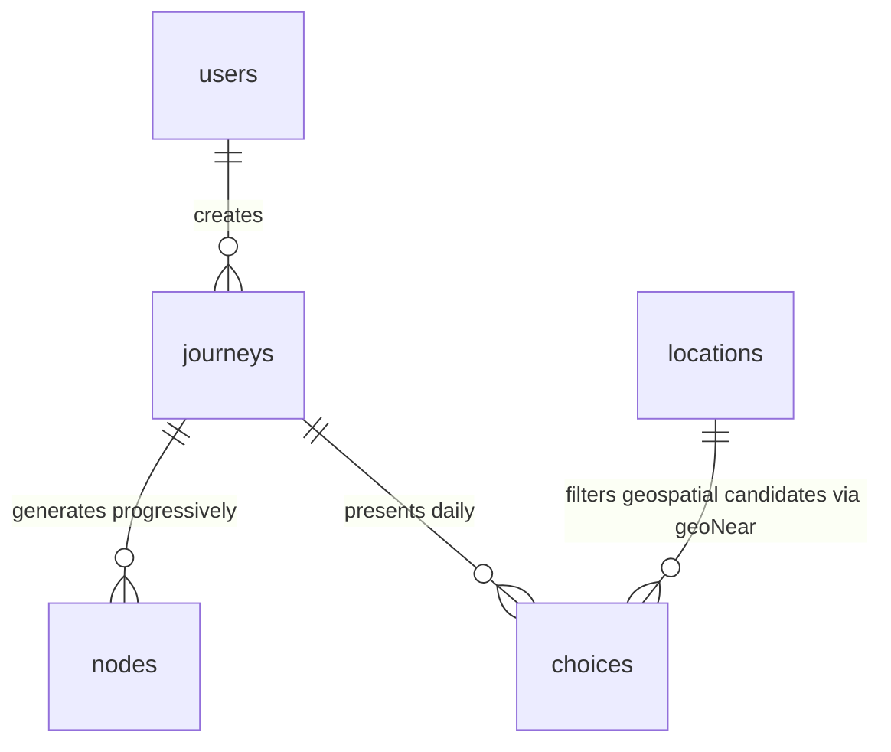

# Project Mini Map — MongoDB Data Models Specification (Draft V1.0)

This document establishes the official BSON schemas, validation rules, relationship mappings, and index layouts for MongoDB Atlas. It serves as the single source of truth for Next.js developers, MongoDB DBA configuration, and Gemini MCP Tool integration.

---

## Part 1 — Common Embedded Structures

These nested structures are reused across multiple collections to maintain strict spatial and financial formatting.

### 1. Multi-Currency Money Struct (`Money`)
Monetary properties must never be stored as simple floats. They are BSON objects combining both the original local currency and the user's localized budget currency, pinned at the transaction exchange rate.

```json
{
  "amount": "Decimal128",       // Cost converted to user's display budgetCurrency (e.g. 44.00)
  "currency": "String",         // User's display currency code (ISO 4217, e.g. "MYR")
  "localAmount": "Decimal128",  // Original cost in destination currency (e.g. 800.00)
  "localCurrency": "String",    // Local currency code (ISO 4217, e.g. "NPR")
  "fxRate": "Decimal128",       // FX rate: localAmount * fxRate = amount (e.g. 0.055)
  "asOf": "Date"                // Timestamp of FX rate lock
}
```

### 2. GeoJSON Point Coordinate Struct (`GeoJSON Point`)
Standard spatial coordinate syntax compliant with MongoDB `2dsphere` index requirements.
```json
{
  "type": { "type": "String", "enum": ["Point"] },
  "coordinates": { 
    "type": "Array", 
    "items": "Double", 
    "minItems": 2, 
    "maxItems": 2 // BSON format: [longitude, latitude]
  }
}
```

---

## Part 2 — Collections Specification



---

### 1. `users` Collection
Stores persistent user profile states, general interests, and the geographical virtual passport stamps.

#### 1.1 Logical Schema & Relationship
- **Relationship**: 1-to-Many with `journeys` (each user can run multiple virtual journeys).
- **Embedded Stamp**: Records a history of completed trips containing aggregated trip costs.

#### 1.2 BSON Document Schema
```javascript
{
  "_id": ObjectId("60c72b2f9b1d8b2bad000001"),
  "userId": "user_abc123",                    // MVP Unique string identifier from frontend session
  "name": "SeeChen Lee",
  "email": "leeseechen@gmail.com",
  "passport": {
    "stamps": [
      {
        "journeyId": ObjectId("60c72b2f9b1d8b2bad000002"),
        "destinationName": "Kathmandu, Nepal",
        "coordinates": {
          "type": "Point",
          "coordinates": [85.3240, 27.7172]  // [longitude, latitude]
        },
        "completedAt": ISODate("2026-10-10T12:00:00Z"),
        "totalDays": 7,
        "totalSpent": {
          "amount": NumberDecimal("3840.00"),
          "currency": "MYR",
          "localAmount": NumberDecimal("69818.00"),
          "localCurrency": "NPR",
          "fxRate": NumberDecimal("0.055"),
          "asOf": ISODate("2026-10-03T08:00:00Z")
        }
      }
    ]
  },
  "createdAt": ISODate("2026-05-17T20:00:00Z"),
  "updatedAt": ISODate("2026-10-10T12:00:00Z")
}
```

#### 1.3 Schema Validation (`$jsonSchema`)
```json
{
  "bsonType": "object",
  "required": ["userId", "passport", "createdAt"],
  "properties": {
    "userId": { "bsonType": "string", "maxLength": 50 },
    "passport": {
      "bsonType": "object",
      "properties": {
        "stamps": {
          "bsonType": "array",
          "items": {
            "bsonType": "object",
            "required": ["journeyId", "destinationName", "coordinates", "completedAt", "totalDays", "totalSpent"],
            "properties": {
              "journeyId": { "bsonType": "objectId" },
              "destinationName": { "bsonType": "string" },
              "coordinates": {
                "bsonType": "object",
                "required": ["type", "coordinates"],
                "properties": {
                  "type": { "enum": ["Point"] },
                  "coordinates": { "bsonType": "array", "minItems": 2, "maxItems": 2 }
                }
              }
            }
          }
        }
      }
    }
  }
}
```

#### 1.4 Index Plan
- `{"userId": 1}` (Unique Index)
- `{"passport.stamps.coordinates": "2dsphere"}` (For mapping out passport stamps dynamically on a global visual map).

---

### 2. `journeys` Collection
The state-machine controller storing active session metadata, cumulative budget usage, and experienced activity tags.

#### 2.1 Logical Schema & Relationship
- **Relationship**: Child of `users`. Parent to `nodes` and `choices`.
- **`visitedTags` array**: Serves as a persistent cache of all experienced location categories, preventing Gemini from offering duplicate experiences in downstream options.

#### 2.2 BSON Document Schema
```javascript
{
  "_id": ObjectId("60c72b2f9b1d8b2bad000002"),
  "userId": "user_abc123",
  "destination": "Kathmandu, Nepal",
  "startDate": ISODate("2026-10-03T00:00:00Z"),
  "totalDays": 7,
  "currentDay": 1,                            // Current active iteration loop state
  "totalBudget": NumberDecimal("6000.00"),
  "remainingBudget": NumberDecimal("5919.00"),// Enforces financial bounds in progressive loops
  "budgetCurrency": "MYR",
  "travelStyle": "backpacker",                // Influences pricing weight and narrative mood
  "interests": ["photography", "temples", "local food"],
  "currentLocation": {
    "type": "Point",
    "coordinates": [85.3559, 27.6966]        // Tracks user's exact geospatial physical position
  },
  "visitedTags": ["airport", "transfer", "thamel"],
  "status": "active",                         // "ready" | "active" | "completed"
  "createdAt": ISODate("2026-10-03T08:00:00Z"),
  "updatedAt": ISODate("2026-10-03T09:30:00Z")
}
```

#### 2.3 Schema Validation (`$jsonSchema`)
```json
{
  "bsonType": "object",
  "required": ["userId", "destination", "totalDays", "currentDay", "totalBudget", "remainingBudget", "budgetCurrency", "status"],
  "properties": {
    "totalDays": { "bsonType": "int", "minimum": 1, "maximum": 14 },
    "currentDay": { "bsonType": "int", "minimum": 0 },
    "totalBudget": { "bsonType": "decimal" },
    "remainingBudget": { "bsonType": "decimal" },
    "status": { "enum": ["ready", "active", "completed"] },
    "currentLocation": {
      "bsonType": "object",
      "required": ["type", "coordinates"],
      "properties": {
        "type": { "enum": ["Point"] },
        "coordinates": { "bsonType": "array", "minItems": 2, "maxItems": 2 }
      }
    }
  }
}
```

#### 2.4 Index Plan
- `{"userId": 1, "status": 1}` (For quick retrieval of active journeys per user)
- `{"currentLocation": "2dsphere"}`

---

### 3. `nodes` Collection
Holds the core immersive daily journal content generated by Gemini. Multiple nodes typically form one single day (represented sequentially by `orderInDay`).

#### 3.1 Logical Schema & Relationship
- **Relationship**: Many-to-1 with `journeys` (Linked via `journeyId`).
- **Media Optimization**: Images are stored as short IDs referencing `AssetCache` strings to optimize pipeline data payload.
- **Embedded Senses & Dialogues**: High-fidelity narrative blocks to drive the immersive client UX.

#### 3.2 BSON Document Schema
```javascript
{
  "_id": ObjectId("60c72b2f9b1d8b2bad000003"),
  "journeyId": ObjectId("60c72b2f9b1d8b2bad000002"),
  "dayNumber": 1,
  "orderInDay": 0,
  "time": "14:30",
  "title": "Arrival at Tribhuvan International Airport",
  "location": {
    "name": "Tribhuvan International Airport",
    "address": "Ring Rd, Kathmandu 44600, Nepal",
    "coordinates": {
      "type": "Point",
      "coordinates": [85.3559, 27.6966]
    }
  },
  "transport": "Prepaid taxi from the official counter",
  "weather": {
    "condition": "Clear",
    "tempC": 22,
    "source": "OpenWeather"
  },
  "priceCategory": "transport",               // accommodation | food | transport | entry | other
  "price": {
    "amount": NumberDecimal("44.00"),
    "currency": "MYR",
    "localAmount": NumberDecimal("800.00"),
    "localCurrency": "NPR",
    "fxRate": NumberDecimal("0.055"),
    "asOf": ISODate("2026-10-03T08:00:00Z")
  },
  "senses": {
    "see": "Terraced hills folding into haze as the plane drops toward the valley.",
    "hear": "The clatter of the baggage belt, horns leaking through the doors.",
    "smell": "Diesel, incense, and dust — the first breath of Kathmandu.",
    "taste": "The metallic dryness of altitude on the back of your tongue.",
    "touch": "Warm vinyl seat of the taxi, the grit of the window crank.",
    "mood": "Equal parts exhaustion and disbelief that you actually came.",
    "story": "The doors slide open and Kathmandu arrives all at once. Horns blare in odd rhythms..."
  },
  "dialogues": [
    {
      "speaker": "Taxi Driver",
      "language": "ne",
      "text": "Thamel? Paltan ho, sajilo cha.",
      "translation": "Thamel? It's busy, but easy to reach."
    }
  ],
  "culture": {
    "cultureTips": ["Use the official prepaid taxi counter to avoid touts."],
    "localPhrase": {
      "phrase": "Namaste",
      "pronunciation": "nuh-muh-STAY",
      "meaning": "Hello / I bow to you"
    },
    "dosDonts": {
      "dos": ["Greet with both palms together at chest level"],
      "donts": ["Don't hand money or objects with your left hand"]
    }
  },
  "practical": {
    "openingHours": "24h",
    "crowdLevel": "high",
    "bestTimeToVisit": "Daytime arrival for the valley view on descent",
    "photoTip": "Grab a window seat on the left for the Himalayan skyline.",
    "bookingRequired": false
  },
  "media": {
    "referencePhotos": ["asset_f98c1b"],      // Lazy-loading asset reference hash
    "ambientSound": "https://freesound.org/airport-ambient-kdu.mp3"
  },
  "searchTags": ["airport", "arrival", "transfer"],
  "embedding": [0.0123, -0.0456, 0.0891, 0.112], // Voyage AI 1024-dim array (truncated)
  "createdAt": ISODate("2026-10-03T09:00:00Z")
}
```

#### 3.3 Schema Validation (`$jsonSchema`)
```json
{
  "bsonType": "object",
  "required": ["journeyId", "dayNumber", "orderInDay", "title", "location", "priceCategory", "price", "senses", "createdAt"],
  "properties": {
    "journeyId": { "bsonType": "objectId" },
    "dayNumber": { "bsonType": "int", "minimum": 1 },
    "orderInDay": { "bsonType": "int", "minimum": 0 },
    "location": {
      "bsonType": "object",
      "required": ["name", "coordinates"],
      "properties": {
        "coordinates": {
          "bsonType": "object",
          "required": ["type", "coordinates"],
          "properties": {
            "type": { "enum": ["Point"] },
            "coordinates": { "bsonType": "array", "minItems": 2, "maxItems": 2 }
          }
        }
      }
    },
    "priceCategory": { "enum": ["accommodation", "food", "transport", "entry", "other"] },
    "embedding": {
      "bsonType": "array",
      "items": { "bsonType": "double" }
    }
  }
}
```

#### 3.4 Index Plan
- `{"journeyId": 1, "dayNumber": 1, "orderInDay": 1}` (Compound Unique Index: essential for progressive stream ordering).
- `{"location.coordinates": "2dsphere"}`
- **Atlas Search Full-Text Index**: Exposing `title`, `senses.story`, `searchTags`, and `location.name` to drive Cross-Trip search bars.
- **Atlas Vector Search Index**:
  ```json
  {
    "mappings": {
      "dynamic": false,
      "fields": {
        "embedding": {
          "type": "knnVector",
          "dimensions": 1024,
          "similarity": "cosine"
        }
      }
    }
  }
  ```

---

### 4. `choices` Collection
Records daily card selections offered to the user. Maintains a strict historical state of the choices generated at the boundary of `DAY_N`.

#### 4.1 Relationship
- **Relationship**: Many-to-1 with `journeys` (Linked via `journeyId`).
- **State Tracker**: `selectedIndex` records the user's click path.

#### 4.2 BSON Document Schema
```javascript
{
  "_id": ObjectId("60c72b2f9b1d8b2bad000004"),
  "journeyId": ObjectId("60c72b2f9b1d8b2bad000002"),
  "forDay": 2,
  "choices": [
    {
      "type": "explore",                       // move | activity | explore | slow
      "title": "Boudhanath Stupa & Pashupatinath Temple",
      "description": "Two of Kathmandu's most powerful sacred sites in one day. A giant white stupa and an open-air cremation ground.",
      "estimatedCost": NumberDecimal("120.00"), // Stored directly in user's display budgetCurrency
      "travelTimeFromCurrent": "20min taxi",
      "destinationCoordinates": {
        "type": "Point",
        "coordinates": [85.3621, 27.7215]
      },
      "destinationName": "Boudhanath, Kathmandu",
      "tags": ["buddhism", "spiritual", "photography"],
      "isRecommended": true
    },
    {
      "type": "slow",
      "title": "Wander the Backstreets of Patan",
      "description": "Slow down and explore ancient courtyards filled with brass workshops and hidden Buddhist shrines.",
      "estimatedCost": NumberDecimal("35.00"),
      "travelTimeFromCurrent": "15min taxi",
      "destinationCoordinates": {
        "type": "Point",
        "coordinates": [85.3252, 27.6766]
      },
      "destinationName": "Patan Durbar Square",
      "tags": ["artisan", "heritage", "slow-travel"],
      "isRecommended": false
    }
    // ... 2 additional options to make exactly 4 choices
  ],
  "selectedIndex": 0,                         // Maps directly to Option A selected by user
  "createdAt": ISODate("2026-10-03T20:00:00Z"),
  "updatedAt": ISODate("2026-10-03T20:15:00Z")
}
```

#### 4.3 Schema Validation (`$jsonSchema`)
```json
{
  "bsonType": "object",
  "required": ["journeyId", "forDay", "choices", "createdAt"],
  "properties": {
    "journeyId": { "bsonType": "objectId" },
    "forDay": { "bsonType": "int", "minimum": 1 },
    "selectedIndex": { "bsonType": ["int", "null"], "minimum": 0, "maximum": 3 },
    "choices": {
      "bsonType": "array",
      "minItems": 2,
      "maxItems": 4,
      "items": {
        "bsonType": "object",
        "required": ["type", "title", "description", "estimatedCost", "destinationCoordinates", "destinationName", "tags"],
        "properties": {
          "type": { "enum": ["move", "activity", "explore", "slow"] },
          "estimatedCost": { "bsonType": "decimal" },
          "destinationCoordinates": {
            "bsonType": "object",
            "required": ["type", "coordinates"],
            "properties": {
              "type": { "enum": ["Point"] },
              "coordinates": { "bsonType": "array", "minItems": 2, "maxItems": 2 }
            }
          }
        }
      }
    }
  }
}
```

#### 4.4 Index Plan
- `{"journeyId": 1, "forDay": 1}` (Unique Compound Index)

---

### 5. `locations` Collection
Internal MongoDB cache of regional Points of Interest (POIs) gathered from Google Places API. This cache is crucial to enforce absolute geographic boundaries.

#### 5.1 Relationship
- **System Anchor**: Serves as the base dataset for **`$geoNear` aggregation queries**. The choice generator queries this collection, filters by distance from the user's previous day location, and serves the results as recommendations.

#### 5.2 BSON Document Schema
```javascript
{
  "_id": ObjectId("60c72b2f9b1d8b2bad000005"),
  "placeId": "ChIJb1b1b1b1b1b1b1b1b1b1b1b",    // Google Places unique place_id
  "name": "Pashupatinath Temple",
  "formattedAddress": "Pashupati Nath Road, Kathmandu 44600, Nepal",
  "geoPoint": {
    "type": "Point",
    "coordinates": [85.3486, 27.7104]
  },
  "costTier": 2,                              // 1 (free/cheap) to 5 (extremely premium)
  "tags": ["hinduism", "temple", "cremation", "heritage", "spiritual"],
  "rating": 4.6,
  "createdAt": ISODate("2026-05-17T20:00:00Z"),
  "updatedAt": ISODate("2026-05-17T20:00:00Z")
}
```

#### 5.3 Schema Validation (`$jsonSchema`)
```json
{
  "bsonType": "object",
  "required": ["placeId", "name", "geoPoint", "costTier", "tags"],
  "properties": {
    "placeId": { "bsonType": "string" },
    "name": { "bsonType": "string" },
    "geoPoint": {
      "bsonType": "object",
      "required": ["type", "coordinates"],
      "properties": {
        "type": { "enum": ["Point"] },
        "coordinates": { "bsonType": "array", "minItems": 2, "maxItems": 2 }
      }
    },
    "costTier": { "bsonType": "int", "minimum": 1, "maximum": 5 },
    "tags": { "bsonType": "array", "items": { "bsonType": "string" } }
  }
}
```

#### 5.4 Index Plan
- `{"placeId": 1}` (Unique Index)
- `{"geoPoint": "2dsphere"}` (Highly critical: enables geoNear radial queries)
- `{"tags": 1}` (Multi-key index to filter categories before running vector calculations)

---

### 6. `AssetCache` Collection
Asynchronous binary store matching heavy Base64 image payloads and visual resources against simple references.

#### 6.1 BSON Document Schema
```javascript
{
  "_id": ObjectId("60c72b2f9b1d8b2bad000006"),
  "assetHash": "asset_f98c1b",                // Corresponds to nodes.media.referencePhotos references
  "mimeType": "image/jpeg",
  "base64Data": "/9j/4AAQSkZJRgABAQEASABIAAD/2wBDAAMCAgMCAgMDAwMEAwMEBQgFBQQEBQoHBwYIDAoMDAsKCwsNDhIQDQ4RDgsLEBYQERMUFRUVDA8XGBYUGBIUFRT/2wBDAQMEBAUEBQkFBQkUDQsNFBQUFBQUFBQUFBQUFBQUFBQUFBQUFBQUFBQUFBQUFBQUFBQUFBQUFBQUFBQUFBQUFBT...", // Complete lazy-loaded image binary string
  "sourceUrl": "https://images.unsplash.com/photo-1544735716-392fe2489ffa?q=80",
  "createdAt": ISODate("2026-05-17T20:00:00Z")
}
```

#### 6.2 Index Plan
- `{"assetHash": 1}` (Unique Index)

---

## Part 3 — Core Database Relationships & Constraints

### 1. Progressive Day Progression Isolation (Constraint)
- A `DayNode` requires `journeyId` and `dayNumber`. The `currentDay` in `journeys` must strictly match the maximum `dayNumber` in `nodes` before transitioning to choice state (`DAY_N` has rendered).

### 2. Multi-Currency Cohesion
- The budget analytics logic must map prices categorized by `priceCategory`. The aggregation query converts nested BSON `price.amount` properties back to `journeys.budgetCurrency` to guarantee clean arithmetic balances.

### 3. Geographical Anti-Hallucination Guard
- Every tomorrow choice's coordinates must locate inside the radial bound computed from the parent `DayNode`'s `endLocation` (i.e. the final node coordinates of the current `dayNumber`):
  ```javascript
  db.locations.find({
    geoPoint: {
      $near: {
        $geometry: { type: "Point", coordinates: [currentLong, currentLat] },
        $maxDistance: 200000 // Radial constraint: 200 kilometers maximum limit
      }
    }
  })
  ```
