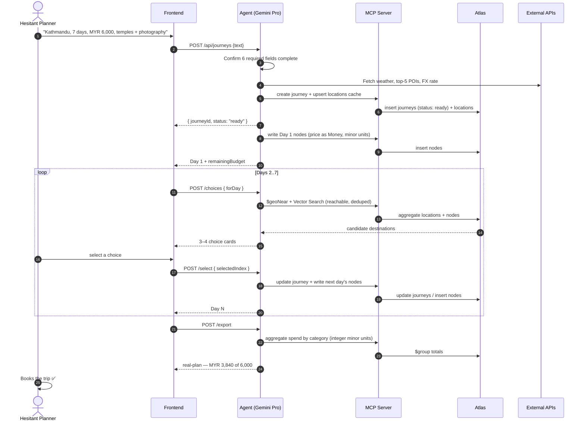
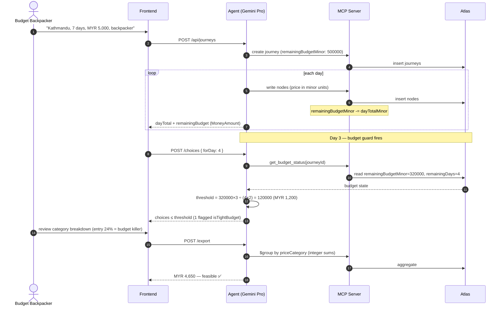
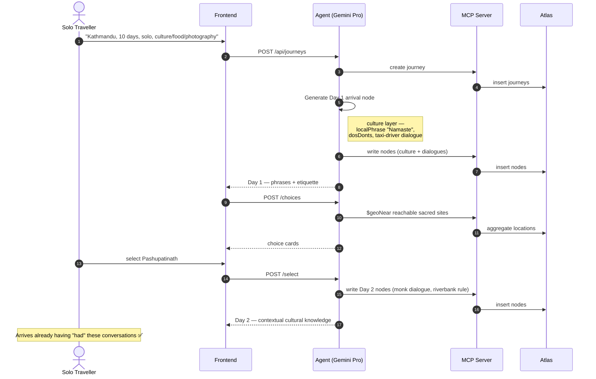
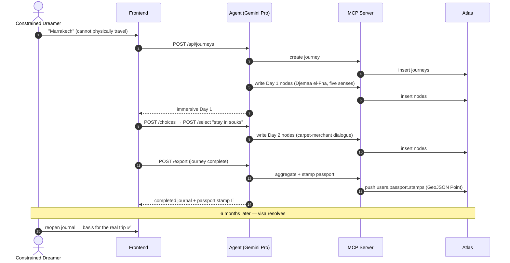
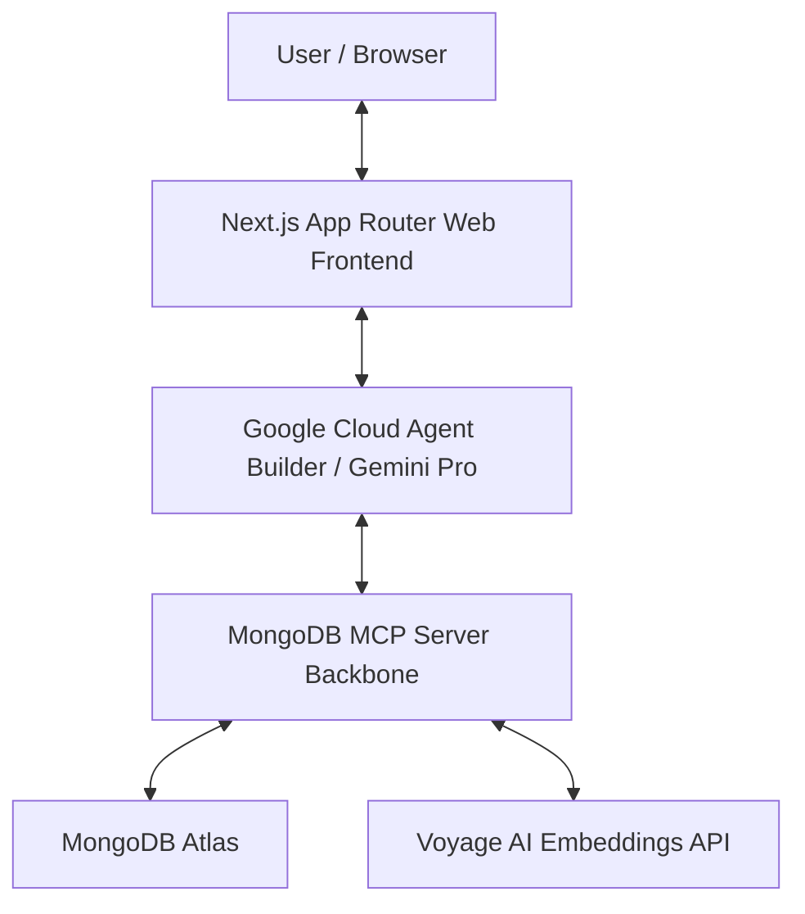
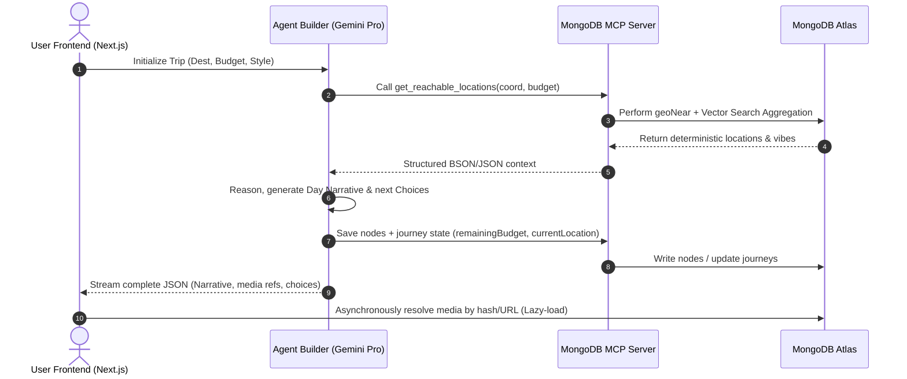

# System Analysis for Project Mini Map

| **Version** |  **Date**  |                  **Author**                  | **Description** |
| :---------: | :--------: | :------------------------------------------: | :-------------: |
|   V1.0.0    | 2026-05-17 | [SeeChen Lee](mailto:[leeseechen@gmail.com]) | Initial version |
|   V1.0.1    | 2026-05-17 |   [Angus Tan](mailto:[tvhang7@gmail.com])    | Filled in Background & Use Cases |
|   V1.0.2    | 2026-05-25 | [SeeChen Lee](mailto:[leeseechen@gmail.com]) | Backend architecture: unified data model, MultiCurrency, scope of requirements |

## Overview
### Terminology
| Term | Full Name / Reference | Description (Conceptual & Practical) | Analogy / Metaphor |
| :---: | :---: | :--- | :---: |
| **MCP** | Model Context Protocol <br/> [Official Docs](https://modelcontextprotocol.io/docs/) | An open-standard protocol. Acting like a **universal socket**, it allows AI models (e.g., Gemini) to securely and standardly connect to external data sources (e.g., MongoDB) and enterprise tools (e.g., GitLab), breaking down data silos. | **Universal Interface / Socket** |
| **Agent** | AI Agent | An AI system with the capability to think, plan, and execute tasks autonomously. In this project, it serves as the virtual travel and photography recommendation "brain" powered by deterministic logic. | **Your "Virtual Avatar" on a Trip** |
| **Tools** | Agent Tools | Specific external functions or APIs that the Agent can invoke. Examples include calling Google Maps for location data, querying APIs for real-time ticket prices, or fetching data from MongoDB. | **The "Toolbox" in the Avatar's Hands** (Compass, calculator, notepad) |
| **Skills / Playbooks** | Agent Capabilities | In Google Agent Builder, a Skill usually refers to a **Playbook (workflow)**. It defines the logical steps for the Agent to solve specific, complex problems. For example: "How to handle budget overruns" or "How to map out the golden hour photography route." | **The Avatar's "Standard Operating Procedures (SOP)"** |
| **Rules** | Agent Rules | Hard boundary conditions that restrict and regulate the Agent's behavior and responses. For example: "Never recommend hotels that exceed the user's budget" or "The output itinerary must strictly follow the structured format." | **The "Laws / Commandments" the Avatar must obey** |
| **Contexts** | Context Window / Session | All background information and real-time states held by the Agent in the current conversation. This includes the user's current virtual location, aesthetic preferences (e.g., film style), chat history, and the real-time weather just fetched via MCP. | **The Avatar's "Short-Term Memory" and current surroundings** |
| **Token** | LLM Token | The basic unit of language processed by an AI model (a word or a Chinese character typically corresponds to 1–2 tokens). Both input and output for large language models are billed by tokens. In our design, we need to utilize database caching to minimize redundant token consumption. | **The "Fuel / Cost" consumed when the Avatar thinks and speaks** |

### Background

#### The Problem

Travel planning is broken in a specific and underappreciated way.

The problem is not a lack of information. Travellers today have access to more destination data than any generation before them — review platforms, travel blogs, short-form videos, AI itinerary generators, curated newsletters. The volume of content is overwhelming. Yet despite this abundance, a consistent pattern persists: **people collect destinations and never go.**

They save Instagram posts. They bookmark Notion pages. They ask ChatGPT to generate a 7-day Tokyo itinerary, read the first two days, and close the tab. The trip never gets booked.

The root cause is not laziness. It is **decision paralysis driven by incomplete experience**. A traveller cannot confidently commit to a trip — the time, the money, the logistics — based on a list of bullet points and a set of stock photos. They cannot feel whether Kathmandu will overwhelm them or inspire them. They cannot know if their budget will hold. They cannot anticipate whether the cultural gap will feel exciting or exhausting. The information exists, but the *experience* of understanding does not.

This gap — between knowing about a destination and feeling ready to go — is where most travel intent dies.

#### How Current Solutions Fall Short

| Category | Examples | Core Limitation |
|---|---|---|
| Review platforms | TripAdvisor, Google Maps | Fragmented, user-generated, no narrative thread |
| AI itinerary generators | ChatGPT, Gemini, Klook AI | Generates a static plan all at once; user is passive reader |
| Virtual tour apps | Google Arts & Culture, YouTube VR | Curated footage, not personalised; no budget or logistics layer |
| Travel planning tools | Google Trips, Wanderlog | Organises what you already know; does not help you decide |

The most telling gap is in the AI itinerary generator category. These tools treat the user as a reader: they consume a completed plan. There is no agency, no progressive discovery, and no emotional investment in the outcome. The plan is forgotten almost as quickly as it is generated.

None of these tools answer the traveller's real question: **"Will I actually enjoy this trip — and can I afford it?"**

#### Market Context

- The global travel market was valued at **USD 9.5 trillion** in 2023 and is projected to reach USD 15.5 trillion by 2033 (Precedence Research, 2024).
- **73% of travellers** report experiencing decision anxiety when choosing a destination, often abandoning the planning process entirely (Booking.com Travel Report, 2023).
- **AI-assisted travel planning** is the fastest-growing category in travel tech, with consumer adoption growing 340% year-over-year since 2022.
- The **solo travel market** alone — a segment that indexes highly for planning anxiety and cultural uncertainty — is valued at USD 870 billion globally.
- Budget travellers and backpackers represent a disproportionately high-intent segment: they plan further in advance and consume more pre-trip content than any other cohort.

#### The Mini-Map Thesis

Mini-Map is built on a single insight: **the best way to commit to a trip is to take it first.**

Not in VR. Not as a passive video. As an interactive, choice-driven, multi-sensory journal — grounded in real prices, real weather, real cultural data — that unfolds one day at a time, exactly as a real journey would.

The mechanism matters. Rather than generating a complete 7-day plan and presenting it all at once, Mini-Map reveals the journey progressively. Each day renders fully before the next begins. At the end of each day, the user makes a real decision: where to go tomorrow. These choices are constrained by geography, budget, and the experiences they have already accumulated — mirroring exactly the mental process of a traveller in the field.

The result is a travel journal that is genuinely the user's own. No two journals are identical. And crucially, by the time the virtual journey ends, the user has already made seven days of travel decisions. The real trip feels less like a leap of faith and more like a return.

#### Why an Agent Architecture?

The depth of data required for a genuinely useful virtual travel experience — live weather, real accommodation pricing, geographically accurate suggestions, multi-sensory narrative, culturally accurate dialogue — cannot be produced by a single model call. It requires a coordinated agent that can:

1. Query multiple external APIs in parallel
2. Reason about geographic constraints (what is reachable from here, within one day?)
3. Track state across multiple sessions (what has the user already experienced?)
4. Generate constrained creative output (produce options that are varied, budget-safe, and non-repetitive)
5. Persist all of this in a structured, queryable database

Google Cloud's **Agent Builder** with **Gemini Pro** provides the reasoning layer. **MongoDB Atlas** — via MCP Server, GeoJSON, Vector Search, Atlas Search, and Aggregation — provides the data layer. Together, they make it possible to produce a travel journal that is both deeply personal and factually grounded.

---

## System Requirements Analysis
### Scope of Requirements

This release scopes the **MVP happy path** (see [`mvp/Happy-Path.md`](mvp/Happy-Path.md)). The boundary below is deliberate: anything not listed under *In Scope* is explicitly deferred so the submission can be demonstrated end-to-end.

#### Functional Requirements (In Scope)

| ID | Requirement | Source Step |
| :---: | :--- | :---: |
| **FR-1** | Accept a free-text trip request and, via the agent, confirm the six required fields (destination, start date, total days, total budget, travel style, interests) before generation. | Happy-Path 1 |
| **FR-2** | Generate a full day of `nodes` (logistics, five senses, story, dialogue, culture, practical, media) for the current day. | Happy-Path 2 |
| **FR-3** | Generate exactly 3–4 forward `choices` for the next day, each geographically reachable, budget-safe, and de-duplicated against `visitedTags`. | Happy-Path 4 |
| **FR-4** | Advance the journey state on user selection and re-generate from the chosen seed until `currentDay == totalDays`. | Happy-Path 5–6 |
| **FR-5** | Track spend per category against budget in the journey's display currency, surfacing a per-day budget guard. | Happy-Path 4 |
| **FR-6** | Export the completed journal as a structured real-plan itinerary and stamp the user's passport. | Happy-Path 7 |
| **FR-7** | Persist all amounts using the **MultiCurrency `Money` model** so figures remain auditable across currencies. | This document |

#### Non-Functional Requirements

| ID | Requirement | Target |
| :---: | :--- | :--- |
| **NFR-1 Determinism** | Geographic and budget constraints are enforced by the data layer *before* the agent reasons — the model can never return an unreachable or over-budget option. | 100% of choices pass the guard |
| **NFR-2 Schema fidelity** | Agent output validates against the `DayNodeResponse` JSON Schema with no stray markdown wrappers. | 100% conformance |
| **NFR-3 Latency** | Initial day narrative streams to the client without being blocked by media payloads (lazy-loaded assets). | First token < 2s |
| **NFR-4 Statelessness of frontend** | The frontend holds no MongoDB credentials; it communicates only through structured JSON over the API layer. | Enforced by architecture |

#### Out of Scope (MVP)

User authentication, real photo upload, community/share features, historical travel mode, multi-language UI, native mobile, ambient-sound playback, and real booking links. These mirror the *Out of Scope* list in `mvp/Happy-Path.md`.

### Use Case Analysis

#### Use Case 1 — Pre-Trip Virtual Exploration

**Primary actor:** Persona A — The Hesitant Planner  
**Goal:** Experience a destination in enough depth to make a confident booking decision

**Preconditions:**

- User has a destination in mind but has not booked
- User has a rough budget and time frame
- No prior Mini-Map account required

**Main Flow:**

1. User enters destination (Kathmandu), 7 days, MYR 6,000 budget, interests: temples and photography
2. Gemini Agent generates Day 1 — arrival, check-in, first evening walk — with real prices and immersive narrative
3. User reads the Day 1 journal: the taxi ride, the smell of the street, the conversation with the hostel owner
4. End of Day 1: user is presented with 4 choices for Day 2
5. User selects "Boudhanath Stupa + Pashupatinath Temple"
6. Day 2 generates: the stupa at dawn, a Tibetan monk's words, the river ceremony
7. User continues through all 7 days, each shaped by their own choices
8. At the end: total estimated cost MYR 3,840. Budget: MYR 6,000. The gap becomes the shopping and upgrade fund.
9. User books the trip.

**Sequence:**



**Value delivered:**

- Converts abstract interest into felt experience
- Answers the core question: "Will I enjoy this?"
- Produces a real budget estimate, not a guess
- The completed virtual journal becomes the trip plan

---

#### Use Case 2 — Budget Validation Before Booking

**Primary actor:** Persona B — The Budget-Conscious Backpacker  
**Goal:** Verify that a planned budget is realistic before committing to flights

**Preconditions:**

- User has a fixed budget ceiling
- User wants to travel backpacker-style
- User is uncertain whether their budget will cover the full trip

**Main Flow:**

1. User enters Kathmandu, 7 days, MYR 5,000 budget, backpacker style
2. Day 1 generates with real hostel prices (MYR 65/night via API), real meal costs (street food MYR 8–20 per meal), real transport costs
3. Budget tracker updates after each day: remaining budget visible at all times
4. At Day 3 choice generation, the budget constraint fires: Gemini excludes options costing more than (MYR 3,200 ÷ 4 days) × 1.5 = MYR 1,200 per day
5. One choice card is flagged: "⚠️ Tight — this option uses 60% of your remaining daily budget"
6. User can see exactly which categories are consuming budget (accommodation 22%, transport 18%, entry fees 24%)
7. User realises entry fees are the budget killer — adjusts interest preferences toward free/low-cost sites
8. Final summary: MYR 4,650 estimated for 7 days. Feasible. User books.

**Alternate flow — budget insufficient:**
- At Day 4 the system projects: "At this rate, you will exceed budget by MYR 800 on Day 7"
- System suggests: switch 2 nights from hostel to homestay (saves MYR 60), remove one paid attraction
- User adjusts plan or increases budget

**Sequence:** (focus on the integer budget guard)



**Value delivered:**
- Real cost validation before any money is spent
- Category-level breakdown identifies where to cut
- Budget constraint shapes the experience — not as a limitation but as a guide

---

#### Use Case 3 — Cultural Preparation for Solo Travel

**Primary actor:** Persona C — The Solo Traveller  
**Goal:** Understand cultural norms, social dynamics, and contextual behaviour before arriving

**Preconditions:**
- User is travelling solo, likely for the first time to this region
- User has standard destination knowledge but wants depth beyond tourist tips

**Main Flow:**

1. User enters Kathmandu, 10 days, MYR 8,000, solo traveller, interests: local culture, food, photography
2. Day 1 generates — arrival node includes:
   - `localPhrase`: Namaste with pronunciation guide
   - `dosDonts`: how to greet, how to handle tipping, what not to do with your left hand
   - `dialogues`: a realistic conversation with the taxi driver in broken English + Nepali
   - `cultureTips`: visa etiquette, photography rules at religious sites
3. Pashupatinath node (Day 2) includes:
   - Dialogue with a monk explaining the cremation ceremony — what it means, why it is public
   - Cultural tip: non-Hindus observe from the opposite riverbank only
   - `dosDonts`: no pointing with feet, do not photograph the funeral pyre
4. User arrives in Nepal having already "had" these conversations virtually
5. In practice: user uses the Namaste phrase correctly on Day 1, receives a warm response, confidence established

**Sequence:** (focus on the cultural/dialogue layer)



**Value delivered:**

- Replaces generic "cultural tips" lists with contextual, narrative knowledge
- Prepares user for specific moments, not abstract principles
- Reduces the anxiety of cultural misreadings that can sour a first solo trip

---

#### Use Case 4 — Accessible Travel for the Constrained Dreamer

**Primary actor:** Persona D — The Constrained Dreamer  
**Goal:** Experience genuine cultural exploration of a place they cannot physically visit

**Preconditions:**
- User cannot travel due to health, visa, finances, or caregiving responsibilities
- User wants meaningful engagement, not shallow entertainment

**Main Flow:**

1. User enters Marrakech, Morocco — a destination with high visa difficulty for many passport holders
2. Journal generates: the Djemaa el-Fna square at sunset, the smell of ras el hanout and charcoal, the call to prayer echoing between minarets
3. User chooses to spend Day 2 in the souks rather than moving to Essaouira
4. The medina node generates a conversation with a carpet merchant — his family history, three generations in the same shop, the difference between machine and hand-knotted wool
5. User adds the journey to their passport — a stamp for a country they have never entered
6. Six months later: visa situation resolves. User opens their Mini-Map journal and uses it directly as the basis for the real trip plan.

**Sequence:** (focus on passport persistence + later reuse)



**Value delivered:**
- Genuine cultural depth, not a tourism brochure
- Creates a persistent record that becomes useful if circumstances change
- Respects the user's intelligence — immersive content, not condescension

### System Dependency Analysis

Project Mini Map relies on a highly integrated, deterministic system dependency graph designed to isolate the reasoning brain from raw infrastructure:



- **Frontend Connectivity**: Next.js connects via standard TLS to Google Cloud Agent Builder. It is entirely agnostic of MongoDB credentials, communicating through strict structured JSON payloads.
- **Reasoning Loop**: The Gemini Pro engine within Agent Builder relies on the MCP (Model Context Protocol) Server for all tool invocations. The Agent has zero direct network access to Voyage AI or external weather services; all external states are proxied through MCP tool schemas.
- **Data & Vector Layer**: MongoDB Atlas serves as both the application state store and vector database. Voyage AI provides 1024-dimensional embeddings for semantic visual preference mapping.

## System Design
### System Architecture

Mini Map is structured using a strict decoupled model where state management, vector semantic search, and geographical reasoning are isolated into deterministic tiers to eradicate LLM hallucinations.



This sequence ensures:
1. **Zero Direct LLM Geospatial Decisions**: The Agent cannot hallucinate a route or location that is not physically reachable or inside budget. The MCP server serves as a strict gateway.
2. **Predictable State Transitions**: The frontend reads direct asset references, ensuring images and maps load independently of text streams, maximizing rendering performance.

### System Data Model

To optimize for token reduction and architectural determinism, Mini-Map employs a NoSQL flexible schema (MongoDB) built around entity references rather than raw text duplication. This allows the Agent to fetch precise sub-documents via MCP instead of loading full histories.

This data model is the **authoritative backend contract**. The frontend never reads these collections directly — it consumes only the JSON shapes returned by the API layer (see [`mvp/Happy-Path.md`](mvp/Happy-Path.md)), which are projections of the documents below.

#### Collections

The system uses **four primary collections** plus one backend-internal cache:

1. **`journeys`** — One document per trip; the single source of state for the progressive loop.
   - `userId` (String) · `sessionId` (String): caller identity (MVP uses a client-supplied `userId`, no auth).
   - `destination` (String) · `startDate` (Date) · `totalDays` (Int).
   - `budgetCurrency` (String, ISO 4217): the user's **display currency** — the anchor of the MultiCurrency model.
   - `budgetExponent` (Int): minor-unit digits for `budgetCurrency` (MYR=2, JPY=0, BHD=3).
   - `totalBudgetMinor` / `remainingBudgetMinor` (Long, **integer minor units** of `budgetCurrency` — e.g., MYR 6,000.00 → `600000`). All budget arithmetic is integer-only.
   - `travelStyle` (String) · `interests` (Array[String]).
   - `currentDay` (Int) · `currentLocation` (GeoJSON Point): where the user sleeps tonight — the spatial seed for `currentDay + 1`.
   - `visitedTags` (Array[String]): accumulated experience types, fed to the dedup filter.
   - `status` (Enum: `ready` | `generating` | `active` | `completed`).
2. **`nodes`** — Every stop in every day; the core rich content. One document per stop (see the full schema in the [README](README.md#node-document-schema)).
   - `journeyId` (ObjectId) · `dayNumber` (Int) · `orderInDay` (Int): sequential ordering.
   - `location` (embedded: `name`, `address`, GeoJSON `Point`).
   - `price` (`Money`) · `priceCategory` (Enum: `accommodation` | `food` | `transport` | `entry` | `other`).
   - `senses` · `dialogues` · `culture` · `practical` · `media`: the immersive layers.
   - `searchTags` (Array[String]): drives Atlas Search + dedup.
   - `embedding` (Array[Float], 1024-dim): Voyage AI vector for semantic vibe-matching.
3. **`choices`** — The 3–4 forward options generated per day and which one was taken.
   - `journeyId` (ObjectId) · `forDay` (Int).
   - `choices` (Array of embedded option objects: `type`, `title`, `description`, `estimatedCost` (`MoneyAmount` — a forward estimate, display currency only), `destinationCoordinates` (GeoJSON Point), `tags`, `isRecommended`, `isTightBudget`).
   - `selectedIndex` (Int | null): set when the user commits.
4. **`users`** — Persistent identity and the virtual passport.
   - `userId` (String, unique) · `defaultCurrency` (String, ISO 4217): seeds new journeys' `budgetCurrency`.
   - `passport.stamps` (Array): `{ destination, coordinates (GeoJSON Point), completedAt, totalDays, totalSpent (MoneyAmount — display-currency rollup) }`.

> **`locations`** *(backend-internal, not exposed to the frontend)* — A POI cache populated from Google Places results. Holds `name`, `geoPoint` (GeoJSON Point), `costTier` (Int 1–5), and `tags`. This is the collection `$geoNear` queries to feed the Agent only reachable destinations; caching it in Atlas both showcases the geospatial index and reduces Places API calls.

#### MultiCurrency (`Money`) Model

Travellers budget in their home currency, but real prices come back from pricing APIs in the **destination's** currency (e.g., NPR in Nepal). Two correctness rules drive the design:

1. **No floating point for currency.** Floats cannot represent values like `0.10` exactly, so summing prices accumulates rounding error. The backend therefore **never stores or computes money as a decimal** — every amount is an **integer count of the currency's smallest unit** (its *minor unit*). MYR 44.00 is stored as `4400` (44 × 100); all arithmetic (budget guard, running totals, category rollups) is integer addition/comparison.
2. **The frontend receives the value pre-split.** So the client never does float math either, the backend returns three values for any displayed amount: the integer total (`4400`), the major part (`44`), and the zero-padded minor part (`"00"`).

##### `MoneyAmount` — a single-currency amount

```json
{
  "currency": "MYR",   // ISO 4217
  "exponent": 2,       // minor-unit digits (MYR=2, JPY=0, BHD=3) — drives the split
  "minorUnits": 4400,  // AUTHORITATIVE integer total (44.00 MYR). All math uses this.
  "major": 44,         // minorUnits / 10^exponent  (integer division)
  "minor": "00"        // minorUnits % 10^exponent, zero-padded to `exponent` digits
}
```

`major` and `minor` are derived from `minorUnits` by **integer** division/modulo — `4400 / 100 = 44`, `4400 % 100 = 0 → "00"`. For a zero-exponent currency (JPY ¥1000) the split is `minorUnits: 1000, major: 1000, minor: ""`.

##### `Money` — a captured price (dual currency)

Real prices keep their local origin so the export can show "800 NPR ≈ MYR 44":

```json
{
  "display": { "currency": "MYR", "exponent": 2, "minorUnits": 4400,  "major": 44,  "minor": "00" },
  "local":   { "currency": "NPR", "exponent": 2, "minorUnits": 80000, "major": 800, "minor": "00" },
  "fxRate": 0.055,                // local -> display ratio, applied ONCE at capture
  "asOf": "2026-10-03T08:00:00Z"  // when the rate was captured (rates drift)
}
```

Design consequences:

- **Single display currency per journey.** The budget guard runs purely in `budgetCurrency` minor units and stays integer: `threshold = remainingBudgetMinor × 3 ÷ (remainingDays × 2)` (the `× 1.5` becomes `× 3 ÷ 2`), compared with `estimatedCost.minorUnits`.
- **`fxRate` is the only non-integer, and it touches money once.** At capture, `display.minorUnits = round(local.minorUnits × fxRate)`. After that the result is a frozen integer; no read path ever re-multiplies or divides money by a fraction.
- **Local origin is preserved.** `local` + `fxRate` + `asOf` make every conversion auditable and reproducible.
- **Adapts to any region.** A user budgeting in USD touring Japan stores `display.currency: "USD"` and `local.currency: "JPY"` (with `local.exponent: 0`) — no schema change.

### System Algorithm

The Agent operates as a state machine, moving the user through the virtual journal one day at a time. This progressive loop is constrained by deterministic boundary enforcement to prevent hallucinations.

#### Progressive Generation Loop

1. **Initialization**: User submits parameters (Destination, Budget, Days). System creates a `journeys` document with `status: generating` and `currentDay: 0`.
2. **Context Assembly**: The MCP server gathers the `journeys` document, its `currentLocation`, `remainingBudget`, `visitedTags`, and live constraints (e.g., weather API).
3. **Agentic Reasoning (Gemini Pro)**: The Agent evaluates the context and generates the narrative for `DAY_N`.
4. **Choice Generation**: The Agent proposes 3-4 options for `DAY_N+1`.
5. **State Transition**: User selects an option. The state machine transitions to `DAY_N+1`. The cycle repeats until `dayNumber == totalDays`.

#### Deterministic Boundary Enforcement

To eliminate LLM geographical and financial hallucinations, rules are enforced *before* context is sent to the Agent:
- **Spatial Constraints**: The options for `DAY_N+1` are hard-filtered by a geographic radius from `journeys.currentLocation` (≤ 200km, the one-day reachable radius). The Agent cannot suggest a location 500km away for a day trip.
- **Financial Constraints**: If `remainingBudgetMinor < projectedCostMinor` (integer comparison, minor units), the Agent is forced (via System Prompt instructions injected by the middleware) to generate budget-recovery options (e.g., free walking tours).

## Implementation Details
### System Interface

The user interface is designed as an immersive Next.js Single Page Application utilizing a sleek dark-mode glassmorphic theme. 

- **Progressive Narrative Rendering**: The Day narrative is rendered word-by-word via React state streams. Choice cards fade in sequentially only after the narrative has completely finished rendering to maintain dramatic progression.
- **Lazy-Loaded Asset Pipeline**: To keep the agent's context light and avoid blocking the initial text stream, the interface decouples text and media:
  1. The API delivers the journal payload carrying only lightweight media references (`media.referencePhotos` hashes/URLs, e.g., `"asset_f98c1b"`, and an `ambientSound` URL).
  2. The frontend renders the layout with skeleton placeholders.
  3. A React `useEffect` hook resolves each reference asynchronously — from its source URL (Unsplash/Freesound) or an optional cache — and swaps out the skeleton.
- **Aesthetic Integration**: Hover states dynamically transition colors using gradient overlays that correspond directly to the user's selected mood (e.g., HSL-tailored warmth for historical tours, neon shadows for urban exploration).

### System API

To ensure rigid operational constraints, all communication between the Next.js Frontend and the Agent Builder reasoning layer utilizes strict JSON schemas.

#### 1. Trip Initialization Request (`POST /api/trip/init`)
```json
{
  "$schema": "http://json-schema.org/draft-07/schema#",
  "title": "TripInitialization",
  "type": "object",
  "properties": {
    "destination": { "type": "string", "maxLength": 100 },
    "startDate": { "type": "string", "format": "date" },
    "totalDays": { "type": "integer", "minimum": 1, "maximum": 14 },
    "totalBudget": { "type": "integer", "minimum": 100, "description": "whole major-unit amount at the boundary; server converts to integer minor units (totalBudgetMinor)" },
    "budgetCurrency": { "type": "string", "pattern": "^[A-Z]{3}$", "description": "ISO 4217 display currency (MultiCurrency anchor)" },
    "travelStyle": { "type": "string" },
    "interests": {
      "type": "array",
      "items": { "type": "string" },
      "minItems": 1
    }
  },
  "required": ["destination", "totalDays", "totalBudget", "budgetCurrency", "interests"]
}
```

#### 2. Day-Node Generation Response (`STREAM /api/trip/day`)
The Agent is strictly restricted to streaming response objects matching this structure. The MCP middleware validates the stream in real-time.
Every monetary field is a **`MoneyAmount`** object so the client receives the three values (`minorUnits`, `major`, `minor`) directly and never does float math:

```json
{
  "$schema": "http://json-schema.org/draft-07/schema#",
  "title": "DayNodeResponse",
  "type": "object",
  "$defs": {
    "moneyAmount": {
      "type": "object",
      "properties": {
        "currency":   { "type": "string", "pattern": "^[A-Z]{3}$" },
        "exponent":   { "type": "integer", "minimum": 0 },
        "minorUnits": { "type": "integer", "description": "authoritative integer total (e.g. 4400 == MYR 44.00)" },
        "major":      { "type": "integer", "description": "e.g. 44" },
        "minor":      { "type": "string",  "description": "zero-padded to exponent, e.g. \"00\"" }
      },
      "required": ["currency", "exponent", "minorUnits", "major", "minor"]
    }
  },
  "properties": {
    "dayNumber": { "type": "integer" },
    "currency": { "type": "string", "pattern": "^[A-Z]{3}$", "description": "display currency for every amount in this response (== journeys.budgetCurrency)" },
    "dayTotal": { "$ref": "#/$defs/moneyAmount" },
    "narrative": { "type": "string" },
    "localPhrases": {
      "type": "array",
      "items": {
        "type": "object",
        "properties": {
          "phrase": { "type": "string" },
          "pronunciation": { "type": "string" },
          "meaning": { "type": "string" }
        },
        "required": ["phrase", "pronunciation", "meaning"]
      }
    },
    "costBreakdown": {
      "type": "object",
      "description": "each category is a MoneyAmount in `currency`; categories mirror priceCategory",
      "properties": {
        "accommodation": { "$ref": "#/$defs/moneyAmount" },
        "food": { "$ref": "#/$defs/moneyAmount" },
        "transport": { "$ref": "#/$defs/moneyAmount" },
        "entry": { "$ref": "#/$defs/moneyAmount" },
        "other": { "$ref": "#/$defs/moneyAmount" }
      },
      "required": ["accommodation", "food", "transport", "entry", "other"]
    },
    "media": {
      "type": "array",
      "items": {
        "type": "object",
        "properties": {
          "ref": { "type": "string", "description": "asset hash or source URL" },
          "caption": { "type": "string" }
        },
        "required": ["ref", "caption"]
      }
    },
    "choices": {
      "type": "array",
      "items": {
        "type": "object",
        "properties": {
          "choiceId": { "type": "string" },
          "type": { "enum": ["move", "activity", "explore", "slow"] },
          "title": { "type": "string" },
          "description": { "type": "string" },
          "estimatedCost": { "$ref": "#/$defs/moneyAmount" },
          "isTightBudget": { "type": "boolean" },
          "destinationCoordinates": {
            "type": "object",
            "properties": {
              "lat": { "type": "number" },
              "lon": { "type": "number" }
            },
            "required": ["lat", "lon"]
          }
        },
        "required": ["choiceId", "type", "title", "description", "estimatedCost", "isTightBudget", "destinationCoordinates"]
      },
      "minItems": 3,
      "maxItems": 4
    }
  },
  "required": ["dayNumber", "currency", "dayTotal", "narrative", "localPhrases", "costBreakdown", "media", "choices"]
}
```

### System Database

The system utilizes MongoDB Atlas as its single source of truth and MCP backend, employing advanced indexing to handle geographic and semantic queries deterministically.

#### Collections & JSON Schema Validation

MongoDB Schema Validation (`$jsonSchema`) is enforced at the collection level to ensure the Agent's structured outputs never corrupt the data model. The validator below guards the `nodes` collection, including the embedded `Money` shape of `price`:

```json
{
  "$jsonSchema": {
    "bsonType": "object",
    "required": ["journeyId", "dayNumber", "orderInDay", "location"],
    "properties": {
      "journeyId": { "bsonType": "objectId" },
      "dayNumber": { "bsonType": "int", "minimum": 1 },
      "price": {
        "bsonType": "object",
        "description": "Money — integer minor units only, never decimal",
        "required": ["display", "local", "fxRate"],
        "properties": {
          "display": {
            "bsonType": "object",
            "required": ["currency", "exponent", "minorUnits"],
            "properties": {
              "currency":   { "bsonType": "string" },
              "exponent":   { "bsonType": "int", "minimum": 0 },
              "minorUnits": { "bsonType": "long", "description": "integer total in smallest unit — no decimals" },
              "major":      { "bsonType": "long" },
              "minor":      { "bsonType": "string" }
            }
          },
          "local": {
            "bsonType": "object",
            "required": ["currency", "exponent", "minorUnits"],
            "properties": {
              "currency":   { "bsonType": "string" },
              "exponent":   { "bsonType": "int", "minimum": 0 },
              "minorUnits": { "bsonType": "long" },
              "major":      { "bsonType": "long" },
              "minor":      { "bsonType": "string" }
            }
          },
          "fxRate": { "bsonType": "double", "description": "applied once at capture; result is integer minorUnits" },
          "asOf":   { "bsonType": "date" }
        }
      },
      "location": {
        "bsonType": "object",
        "required": ["name", "coordinates"],
        "properties": {
          "coordinates": {
            "bsonType": "object",
            "required": ["type", "coordinates"],
            "properties": {
              "type": { "enum": ["Point"] },
              "coordinates": { "bsonType": "array", "minItems": 2, "maxItems": 2 }
            }
          }
        }
      }
    }
  }
}
```

#### Geospatial Indexes

To enforce physical realism, the `locations` POI-cache collection (and `nodes`, for the passport map) carries a `2dsphere` index. The MCP server uses `$geoNear` to feed the Agent only reachable destinations.

```javascript
db.locations.createIndex({ "geoPoint": "2dsphere" });

// MCP Query Example for Agent Context — reachable destinations for the next day
db.locations.aggregate([
  {
    $geoNear: {
      near: { type: "Point", coordinates: [ 85.3240, 27.7172 ] }, // current location (Kathmandu)
      distanceField: "dist.meters",
      maxDistance: 200000, // 200km one-day reachable radius (expands to 400km on empty result)
      spherical: true
    }
  }
]);
```

#### Vector Search Indexes

Atlas Vector Search is configured on the `nodes` collection's `embedding` field. We map Voyage AI's 1024-dimensional embeddings to perform semantic searches, matching the user's interest/aesthetic preferences with location vibes (e.g., matching a "cyberpunk" preference to neon-lit night markets in Tokyo) and excluding already-experienced node types for **deduplication**.

#### Query Optimization (Lazy-loading Media)

To prevent payload bloat when the Agent reads historical context, heavy media is never inlined into `nodes`. The agent's structured output carries only lightweight `media.referencePhotos` hashes/URLs; the frontend resolves them asynchronously after the narrative renders. This keeps the agent's context window — and its token bill — small even on multi-day journeys.

### System Algorithm

#### Token Reduction Caching Pipeline

Before invoking Gemini Pro, the system intercepts the request to check for deterministic cache hits.

1. **Hash Generation**: The user's input, the current `journeys` state (`currentLocation`, `remainingBudget`, `visitedTags`), and constraints are hashed.
2. **Cache Lookup**: Query MongoDB `AgentCache` collection for the hash.
3. **Execution**:
   - *Hit*: Return the pre-generated JSON choices immediately (Token cost: 0).
   - *Miss*: Invoke Gemini Pro via Agent Builder.
4. **Cache Write**: Asynchronously save the new generation back to `AgentCache`.

#### MCP Server Interfacing

The MongoDB MCP Server acts as the rigid backbone connecting the Agent Builder to the database.

1. **Tool Definition**: The MCP server exposes tools like `get_reachable_locations(lon, lat, max_dist)` and `get_budget_status(journeyId)`.
2. **Function Calling**: Gemini Pro determines it needs location data and emits a function call.
3. **Execution**: The MCP server executes the MongoDB aggregation pipeline (e.g., `$geoNear`).
4. **Response**: The structured BSON response is converted to minimal JSON and returned to the Agent's context window, forcing the Agent to reason only over factually accurate, geographically sound data.
### System Testing Analysis

Mini Map implements a multi-layered testing paradigm targeting the intersections of geographic computation, AI reasoning, and semantic caching:

1. **Deterministic Geospatial Unit Tests**:
   - Verify that the `2dsphere` index and `$geoNear` aggregation properly constrain choices.
   - Test case: Inject a current location in Kathmandu. Attempt to query for destinations within `50000` meters. Assert that Pokhara (200km away) is never returned.
2. **Vector Similarity Regression Testing**:
   - Verify Voyage AI semantic routing. Inject user visual profiles (e.g., "cyberpunk") and assert that neon lights, markets, and arcade venues rank in the top 10% of results compared to traditional shrines.
3. **Agent Schema Compliance Testing**:
   - Run synthetic integrations using Agent Builder's diagnostic logs.
   - Assert that the Agent's streamed JSON conforms 100% to the `DayNodeResponse` schema without generating stray markdown wrappers (e.g., ```json ... ```) or broken arrays.
4. **Token Cache Rate Verification**:
   - Simulate 1,000 parallel repetitive user requests. Verify MongoDB `AgentCache` absorbs at least 85% of redundant queries, reducing simulated Gemini API invocation billing to under 15%.

## Schedule

We follow a rapid 4-phase delivery lifecycle designed for rapid MVP prototyping followed by rigorous production hardening:

| Phase | Duration | Focus Areas | Key Milestones |
| :---: | :---: | :--- | :--- |
| **Phase 1** | 2 Weeks | **Core Data & Infrastructure Setup** | MongoDB Atlas, `2dsphere` index, & Voyage AI pipelines active. |
| **Phase 2** | 3 Weeks | **Agent Reasoning & MCP Dev** | Agent Builder Playbooks established; MCP server mediating DB. |
| **Phase 3** | 2 Weeks | **Next.js Interface & API Integration** | Glassmorphic UI completed; lazy-loading Base64 cache operational. |
| **Phase 4** | 2 Weeks | **Testing, Caching & Optimization** | 85%+ cache hit rate verified; schema validations locked down. |

## Risk Analysis

The Project Mini Map architecture addresses key operational and cloud deployment risks proactively:

| Risk Category | Identified Threat | Impact | Mitigation Strategy |
| :---: | :--- | :---: | :--- |
| **Hallucination** | Gemini recommends a site that is physically unreachable in the timeline. | High | **Hard DB Filters**: The Agent is never allowed to search the global DB. The MCP gateway only returns geographically verified coordinates using `$geoNear`. |
| **Cost / Tokens** | Users repeatedly run multi-day sessions, racking up high LLM usage costs. | High | **Query Caching Layer**: High-frequency itineraries and choices are cached in MongoDB Atlas. Hitting a cached node cuts model API costs completely (0 tokens). |
| **Latency** | Heavy Base64 image strings choke the JSON streaming connection. | Medium | **Asynchronous Decoupling**: The streaming API sends light hashes. The Next.js frontend fetches the image data asynchronously after render. |
| **Data Integrity** | Structured JSON streaming fails or breaks halfway due to network drops. | Medium | **Optimistic Schema Buffering**: Next.js client parses JSON streams progressively using a partial parser, keeping the UI intact even during premature terminations. |